# Content Safety Evaluation Suite – Full README with Environment Variables

This repository contains scripts and datasets used to evaluate Content Safety across
text, images, groundedness, and protected‑material detection. All scripts support
batch processing and output JSON/CSV for reporting.

---

## 📂 Repository Structure

```
/scripts        -> Bash scripts for text, image, groundedness, and protected-material testing
/test-data      -> Input text samples, code samples, images
/results        -> JSON logs, CSV summaries, detection percentages
/logs           -> Execution logs
```

---

# 🧰 Scripts Overview & Required Environment Variables

Below is the **complete list of all scripts** and their **required environment variables**.

---

## 1. **cs-test.sh**  
### Purpose  
Runs Azure Content Safety text checks:  
- toxicity  
- hate  
- violence  
- self-harm  
- sexual content  
- copyright detection  

### Environment Variables (MANDATORY)
```
export AZURE_CS_ENDPOINT="https://<endpoint>.cognitiveservices.azure.com/"
export AZURE_CS_KEY="<your-key>"
export AZURE_CS_VERSION="2024-09-01"
```

### Run
```
./cs-test.sh input_prompts.txt results/content_safety.json
```

---

## 2. **groundedness_detection.sh**  
### Purpose  
Tests hallucination, unsupported claims, grounding score, factual correctness.

### Environment Variables (Google Safety API)
```
export GOOGLE_API_KEY="<your-safety-api-key>"
export GOOGLE_GROUNDEDNESS_ENDPOINT="https://safety.googleapis.com/v1alpha1/grounding:check"
```

### Run
```
./groundedness_detection.sh grounded_input.txt results/groundedness.json
```

---

## 3. **image_moderation.sh**  
### Purpose  
Uses **Google Cloud Vision SafeSearch** to detect:  
- adult  
- violence  
- racy  
- spoof  
- medical/disturbing content  

### Environment Variables (Google Cloud Vision)
```
export GOOGLE_APPLICATION_CREDENTIALS="service-account.json"
```

### Run
```
./image_moderation.sh images/ results/image_safety.csv
```

---

## 4. **protected_material_text.sh**  
### Purpose  
Detects copyrighted or proprietary **text** material.  
Outputs:  
- Copyrighted (Blocked)  
- OK to Use (Allowed)

### Environment Variables
```
export OPENAI_API_KEY="<your-key>"
export OPENAI_PROTECTED_TEXT_ENDPOINT="https://api.openai.com/v1/protected-material/text"
```

### Run
```
./protected_material_text.sh text_samples.txt results/protected_text.csv
```

---

## 5. **protected_material_code.sh**  
### Purpose  
Detects protected, copyrighted, licensed, or proprietary **code** snippets.  
Useful for identifying source-code leaks or reuse violations.

### Environment Variables
```
export OPENAI_API_KEY="<your-key>"
export OPENAI_PROTECTED_CODE_ENDPOINT="https://api.openai.com/v1/protected-material/code"
```

### Run
```
./protected_material_code.sh code_samples.txt results/protected_code.csv
```

---

# 🔄 End-to-End Flow Diagram

```mermaid
flowchart TD
    A[Test Input Files] --> B[Scripts]
    B --> C[Azure Content Safety – Text]
    B --> D[Google Groundedness – Hallucination Detection]
    B --> E[Google Vision – Image Safety]
    B --> F[Protected Material – Text]
    B --> G[Protected Material – Code]

    C --> R[Results]
    D --> R
    E --> R
    F --> R
    G --> R

    R --> S[Summary Tables & Reports]
```



---

# 🔐 Security Notice

- Never commit API keys or service accounts.  
- `.gitignore` already excludes secrets and sensitive files.  
- Remove third-party copyrighted samples before publishing.

---

# 📬 Contact

Modify or extend any scripts under `/scripts`.  
For enhancements, open an internal ticket or GitHub issue.

